# PoC: expand an Azure API Management subnet

An isolated lab using **Bicep**, with **PowerShell 7 or native Bash** operational scripts and two separate procedures:

1. **Direct experiment:** attempt to expand the occupied subnet from /27 to /26 while keeping APIM attached, and record Azure's response.
2. **Option 2:** move APIM to a temporary subnet, expand the empty original subnet, and move APIM back. The lab migration completed successfully on September 23, 2026, in **1 hour, 12 minutes and 49 seconds**. See the [migration results](APIM-SUBNET-MIGRATION-RESULTS.md).

The direct experiment does not move APIM or create a temporary subnet. If Azure rejects the change, it stops and records the error. Option 2 requires a separate invocation and confirmation. Neither procedure performs automatic fallback or rollback.

The reference environment is **classic Premium / External**, but this PoC uses **Developer / External**, one unit and one region to reduce cost. **It does not demonstrate Premium SLA, availability or capacity.** Developer may be unavailable during updates. APIM infrastructure changes can take 15 minutes or longer.

## Execution flow

The diagram separates the direct occupied-subnet experiment from the explicitly
selected temporary-subnet migration; rejection does not trigger automatic fallback.
Arrows show execution order, the diamond selects an operation, and rectangles
represent steps or outcomes. Error paths are summarized: any migration-stage
failure stops execution and records evidence, without automatic rollback.
Each migration stage checks state and point-in-time HTTP health; these checks do
not demonstrate continuous availability.

Editable standalone source: [APIM subnet expansion flow](apim-subnet-resize-flow.mmd).
Keep that source and the embedded diagram below in sync.

```mermaid
---
title: APIM subnet expansion - direct experiment and temporary migration
config:
  layout: elk
---
flowchart LR
    target["Resolve lab target<br/>Explicit parameters override local .env"]
    mode{"Selected operation"}
    skipped["Skipped<br/>No Azure mutation"]
    failure["Record failure and stop<br/>No automatic rollback or resubmission"]

    subgraph direct["Invoke-SubnetExperiment.ps1 - TryResizeOccupied"]
        directPre["Capture snapshot<br/>Validate occupied original /27 and lab safeguards"]
        attempt["Request original subnet expansion<br/>/27 to /26 while APIM remains attached"]
        verify["Capture resulting state<br/>Verify /26 and unchanged APIM subnet"]
        directDone["ControlPlaneSucceeded<br/>Gateway availability checked separately"]
        directPre -->|"Approves mutation"| attempt
        attempt -->|"Azure accepts update"| verify
        verify -->|"Postconditions pass"| directDone
    end

    subgraph migration["Invoke-SubnetMigration.ps1 - Run"]
        migrationPre["Capture snapshot and validate lab<br/>Require original /27 and no temporary subnet"]
        prepare["PrepareTemporary<br/>Create temporary /27 with original NSG"]
        moveTemporary["MoveTemporary<br/>Submit APIM move and poll target + Succeeded"]
        release["ResizeEmpty: wait for release<br/>Poll until original subnet has no allocations"]
        resize["ResizeEmpty: expand original<br/>Update empty /27 to /26"]
        moveBack["MoveBack<br/>Return APIM and poll target + Succeeded"]
        migrationDone["Verified<br/>Original /26 in use; temporary subnet retained"]
        migrationPre -->|"Approves mutation"| prepare
        prepare -->|"Verifies state and health"| moveTemporary
        moveTemporary -->|"Verifies state and health"| release
        release -->|"Confirms original is empty"| resize
        resize -->|"Verifies state and health"| moveBack
        moveBack -->|"Verifies state and health"| migrationDone
    end

    target -->|"Resolves required identifiers"| mode
    mode -->|"Selects direct experiment"| directPre
    mode -->|"Selects full migration"| migrationPre
    directPre -->|"Declines or uses WhatIf"| skipped
    migrationPre -->|"Declines or uses WhatIf"| skipped
    attempt -->|"Azure rejects or fails"| failure
    verify -->|"Postconditions fail"| failure
    release -->|"Times out without resizing"| failure
```



## Documentation language

**English is the default language for all repository documentation**, including Markdown files, headings, tables, example comments and explanatory messages in documentation examples. Preserve script parameters, recorded outcomes and evidence paths; keep real environment identifiers in local configuration rather than published examples.

Use English document filenames and update internal links when renaming documents. Contributor and agent guidance is available in [AGENTS.md](AGENTS.md).

## Known constraints and measurements

The [subnet documentation](https://learn.microsoft.com/en-us/azure/virtual-network/virtual-network-manage-subnet#change-subnet-settings) instructs users to move or remove resources before changing a subnet's address range. This project therefore **does not assume that expanding an occupied subnet is supported**. The test records Azure's actual response. An RBAC, Azure Policy or transient failure does not establish a subnet restriction.

Expanding the subnet means decreasing the prefix length: **/27 to /26**, from 32 to 64 total addresses, or from 27 to 59 usable addresses after Azure's five reservations. This does not mean 59 free addresses: APIM also consumes IPs. This lab does not require a larger VNet.

| Resource | Configuration |
|---|---|
| Resource group | New group with prefix `rg-apim-resize-poc` and tag `purpose=apim-subnet-resize-poc` |
| VNet | `vnet-apim-resize-poc`, `10.90.0.0/16`, no peering |
| Original subnet | `snet-apim-original`, `10.90.0.0/27` expanded to `10.90.0.0/26` |
| NSG | Public HTTPS 443, management 3443 through ApiManagement, probe 6390 through AzureLoadBalancer |
| APIM | Globally unique name with prefix `apim-resize-poc-`, Developer, External |
| Mock API | `GET /subnet-poc/health`, HTTP 200 and `{"status":"ok","poc":"apim-subnet-resize"}` |

The Bicep template creates one subnet with no delegation, associated with the NSG. Both /27 and /26 fit within the /16 VNet. APIM and the network share a subscription and region. APIM manages its public IP; the template does not create a separate public IP resource. Only the option 2 script creates `snet-apim-temporary`, `10.90.1.0/27`, outside the original /26 block.

The mock API is public, requires no subscription key, exposes no real data and calls no backends. The NSG retains default outbound rules for APIM dependencies. There is no firewall, VPN, custom DNS, Log Analytics or paid DDoS plan. **Do not use this design as a production baseline.**

## Files

PowerShell scripts and tests live in [scripts/ps1](scripts/ps1) and
[tests/ps1](tests/ps1). Native Bash equivalents live in
[scripts/sh](scripts/sh) and [tests/sh](tests/sh). Local configuration
(`.env` and `.env.test`) and the ignored `artifacts` directory remain at the
repository root. Run the examples below from that root.

- [Approved plan](.azure/infrastructure-plan.json)
- [Bicep infrastructure](infra/main.bicep)
- [Experiment actions](scripts/ps1/Invoke-SubnetExperiment.ps1)
- [Option 2 migration](scripts/ps1/Invoke-SubnetMigration.ps1)
- [Comparison of the three alternatives](APIM-SUBNET-EXPANSION-OPTIONS.md)
- [Migration results](APIM-SUBNET-MIGRATION-RESULTS.md)
- [Optional HTTP monitor](scripts/ps1/Watch-Gateway.ps1)
- [Offline tests](tests/ps1/Test-Local.ps1)
- [Offline migration tests](tests/ps1/Test-Migration.ps1)
- [Local configuration template](.env.example)
- [Synthetic test configuration template](.env.test.example)
- [Offline configuration tests](tests/ps1/Test-Environment.ps1)
- [Native Bash experiment](scripts/sh/invoke-subnet-experiment.sh)
- [Native Bash migration](scripts/sh/invoke-subnet-migration.sh)
- [Native Bash HTTP monitor](scripts/sh/watch-gateway.sh)
- [Shared Bash helpers](scripts/sh/common.sh)
- [Offline Bash tests](tests/sh/test-bash.sh)

## Choosing PowerShell or Bash

The `.ps1` files run with **PowerShell 7** (`pwsh`). The `.sh` files run with
**Bash 4+** (`bash`), not plain `sh`. Bash is a native implementation and does
not invoke PowerShell. Choose one implementation for each approved operation;
do not run network mutations from both shells concurrently.

| Purpose | PowerShell | Native Bash |
|---|---|---|
| Attempt one occupied-subnet resize | [Invoke-SubnetExperiment.ps1](scripts/ps1/Invoke-SubnetExperiment.ps1) | [invoke-subnet-experiment.sh](scripts/sh/invoke-subnet-experiment.sh) |
| Migrate through a temporary subnet | [Invoke-SubnetMigration.ps1](scripts/ps1/Invoke-SubnetMigration.ps1) | [invoke-subnet-migration.sh](scripts/sh/invoke-subnet-migration.sh) |
| Sample gateway health during changes | [Watch-Gateway.ps1](scripts/ps1/Watch-Gateway.ps1) | [watch-gateway.sh](scripts/sh/watch-gateway.sh) |
| Shared configuration and safety helpers | [Common.ps1](scripts/ps1/Common.ps1) | [common.sh](scripts/sh/common.sh) |
| Offline regression tests | [tests/ps1](tests/ps1), three `Test-*.ps1` suites | [test-bash.sh](tests/sh/test-bash.sh), one suite |
| Synthetic test configuration loader | [tests/ps1/Common.ps1](tests/ps1/Common.ps1) | [tests/sh/common.sh](tests/sh/common.sh) |

Keep each helper beside its entrypoints and preserve the folder layout. Scripts
resolve default configuration and evidence paths from the repository root,
two levels above their folders. Helpers support the entrypoints; running a
helper alone does not perform an experiment or migration.

PowerShell operations require Azure CLI; HTTP requests use PowerShell's built-in
web commands. Bash operations require Azure CLI, jq and curl in the same
Linux or WSL environment. Use backslashes in the Windows PowerShell examples
and POSIX paths in Bash. Initial deployment and cleanup examples in this README
remain PowerShell examples; the Bash entrypoints operate on an already-deployed lab.

### Equivalent parameters

| Purpose | PowerShell | Bash |
|---|---|---|
| Select action | `-Action Snapshot` | `--action Snapshot` |
| Select operational configuration | `-EnvFile PATH` | `--env-file PATH` |
| Override target | `-SubscriptionId`, `-ResourceGroup`, `-ApimName` | `--subscription-id`, `--resource-group`, `--apim-name` |
| Preview without submitting mutations | `-WhatIf` | `--what-if` |
| Bypass interactive confirmation for an approved run | `-Confirm:$false` | `--yes` |
| Select evidence directory | `-EvidenceRoot PATH` | `--output-root PATH` |
| Set migration polling | `-TimeoutSeconds`, `-PollSeconds` | `--timeout-seconds`, `--poll-seconds` |
| Override monitor endpoint | `-Url` | `--url` |
| Set monitor timing | `-DurationMinutes`, `-IntervalSeconds`, `-RequestTimeoutSeconds` | `--duration-minutes`, `--interval-seconds`, `--request-timeout-seconds` |
| Select offline test configuration | `-TestEnvFile PATH` | `--test-env-file PATH` |

Action names retain their exact spelling in both shells. PowerShell migration
requires `-Action`; both Bash operation entrypoints default to `Snapshot`.
Use an explicit action in runbooks. `Snapshot` and mutation previews still
query Azure and write local evidence; only the mocked test suites are offline.
Neither implementation retries mutations, rolls back or deletes resources automatically.

For operational instructions, see the [direct experiment](#3-attempt-to-expand-the-occupied-subnet),
[option 2 migration](#4-option-2-expand-using-a-temporary-subnet) and
[native Bash usage](#native-bash-usage). The September 23 cloud execution used
PowerShell; Bash has only local mocked validation.

## Local environment configuration

Keep subscription and tenant IDs, resource names and the publisher email in a
root `.env` file. It is ignored by Git and must not be shared. On a fresh clone,
copy [.env.example](.env.example) to `.env` and fill in your lab values. Do not
overwrite an existing populated `.env`.

Generic examples for the subscription and tenant fields:

```dotenv
AZURE_SUBSCRIPTION_ID=00000000-0000-0000-0000-000000000001
AZURE_SUBSCRIPTION_NAME=example-subscription
AZURE_TENANT_ID=00000000-0000-0000-0000-000000000002
```

These are illustrative values, not a working Azure target. Use your actual values
only in the ignored local `.env`.

Both experiment and migration scripts resolve `SubscriptionId`, `ResourceGroup`
and `ApimName` from explicit parameters first, then from `AZURE_SUBSCRIPTION_ID`,
`AZURE_RESOURCE_GROUP` and `APIM_NAME` in `.env`. The default file is relative to
the scripts' project root, independent of the terminal's current directory.
Use `-EnvFile '<absolute-path-to-local-config>'` for a different file. When all
three target parameters are supplied, the scripts do not read an environment file.
Shell environment variables and the Azure CLI default subscription are not used
as fallbacks. Missing or invalid targets fail before Azure calls and run logs.

The HTTP monitor also reads `.env` by default, but needs only `APIM_NAME` to
derive `https://<APIM_NAME>.azure-api.net/subnet-poc/health`. Its optional `-Url`
parameter takes precedence and bypasses configuration loading. `-EnvFile` selects
an alternative local file. An explicitly empty/invalid URL is rejected, not
replaced by a configuration value. Validation happens before HTTP calls or
evidence creation; the monitor still accepts only the lab HTTPS endpoint.

Use one `KEY=value` per line. Blank lines and full-line `#` comments are allowed.
Matching single or double quotes around values are optional. Values are literal:
there is no interpolation, command execution, escape processing, inline-comment
removal or process-environment modification. Unknown or duplicate keys are rejected.
Use only the keys listed in the example.

The native Bash entrypoints use the same local configuration contract. Their
equivalent flags are `--env-file`, `--subscription-id`, `--resource-group`,
`--apim-name` and monitor `--url`. Do **not** run `source .env` or `eval` its
contents: the scripts parse values literally. See [native Bash usage](#native-bash-usage).

For manual deployment, inspection or cleanup commands, load variables in each new terminal
from the project root (this block does not call Azure):

```powershell
. .\scripts\ps1\Common.ps1
$settings = Get-LabEnvironment
$lab = Resolve-LabTarget -Overrides @{}
$subscription = $lab.SubscriptionId
$rg = $lab.ResourceGroup
$apim = $lab.ApimName
$location = $settings['AZURE_LOCATION']
$tenant = $settings['AZURE_TENANT_ID']
$email = $settings['APIM_PUBLISHER_EMAIL']
```

`AZURE_SUBSCRIPTION_NAME` and `LAB_DEPLOYMENT_CORRELATION_ID` are optional
historical metadata, not deployment inputs. The health URL is derived from
`APIM_NAME`. Fixed lab subnet names and CIDRs remain in infrastructure and safety
guards; `.env` does not change the supported topology.

Local configuration is plaintext, not a secret store. Do not add access tokens,
passwords or keys. Logs and snapshots under `artifacts` still contain environment
metadata and remain local-only. Local Git history was restarted with a single
root commit of the current files, excluding earlier commits that contained
environment identifiers. Subscription and tenant examples are synthetic.
Restarting history does not erase existing clones, reflogs, unreachable Git
objects or local evidence. Review all tracked files before public release.

## Offline test configuration

Operational scripts use the private `.env`; **offline tests use a separate
`.env.test` with fictitious data**. Both local files are ignored by Git.
Only the templates [.env.example](.env.example) and
[.env.test.example](.env.test.example) are publishable.

Before running tests on a fresh clone, copy the synthetic template without
overwriting an existing test configuration:

```powershell
if (-not (Test-Path -LiteralPath '.env.test')) {
    Copy-Item -LiteralPath '.env.test.example' -Destination '.env.test'
}
```

All three PowerShell test entrypoints accept `-TestEnvFile`:

```powershell
pwsh -File .\tests\ps1\Test-Environment.ps1 -TestEnvFile 'C:\labs\.env.test'
pwsh -File .\tests\ps1\Test-Local.ps1 -TestEnvFile 'C:\labs\.env.test'
pwsh -File .\tests\ps1\Test-Migration.ps1 -TestEnvFile 'C:\labs\.env.test'
```

For Bash, create the same synthetic configuration without overwriting an existing
file, then run the independent offline suite:

```bash
if [ ! -e .env.test ]; then
    cp .env.test.example .env.test
fi
bash tests/sh/test-bash.sh
# Optional alternative synthetic configuration:
bash tests/sh/test-bash.sh --test-env-file /absolute/path/to/.env.test
```

The Bash suite requires Bash 4+, jq and curl, uses command mocks for Azure and
HTTP, and does not require PowerShell or Azure sign-in. Its `--test-env-file`
follows the same reserved synthetic identity rules below.

To validate a fresh clone without creating either local configuration file,
select the checked-in synthetic template explicitly:

```powershell
pwsh -File .\tests\ps1\Test-Environment.ps1 -TestEnvFile .\.env.test.example
pwsh -File .\tests\ps1\Test-Local.ps1 -TestEnvFile .\.env.test.example
pwsh -File .\tests\ps1\Test-Migration.ps1 -TestEnvFile .\.env.test.example
```

```bash
for file in scripts/sh/*.sh tests/sh/*.sh; do
    bash -n "$file" || exit 1
done
bash tests/sh/test-bash.sh --test-env-file .env.test.example
```

The default `.env.test` path is relative to the project root, not the current
directory. Missing or invalid test configuration fails explicitly; there is no
fallback to `.env`, the example file or shell environment variables. The shared
[test loader](tests/ps1/Common.ps1) reuses the literal environment parser and rejects
files named `.env`. Test configuration accepts exactly these four required keys:

| Key | Synthetic fixture requirement |
|---|---|
| `AZURE_SUBSCRIPTION_ID` | Nonzero GUID starting with `00000000-0000-0000-0000-` |
| `AZURE_RESOURCE_GROUP` | `rg-apim-resize-poc-test`, optionally followed by a hyphenated suffix |
| `APIM_NAME` | `apim-resize-poc-test`, optionally followed by a hyphenated suffix |
| `AZURE_LOCATION` | Canonical lowercase region name, such as `eastus2` |

Never copy real subscription, tenant, resource or publisher values into test
configuration. These conventions identify fixtures, not deployable resources.
The tests mock Azure CLI and HTTP and require no Azure sign-in. Integration cases
create temporary **fictitious** `.env` files to exercise operational configuration
loading and clean them up afterward; they do not read the real project `.env`.

Fixed VNet/subnet names, CIDRs and deliberate invalid-input or normalization
examples remain in the tests because they verify the lab's safety contract.
Moving baseline identities and region into configuration does not relax these
guards or make the scripts suitable for arbitrary networks.

## 1. Prepare and validate locally

The PowerShell examples require PowerShell 7 (`pwsh`), Azure CLI and Bicep CLI.
The [native Bash operational path](#native-bash-usage) instead requires Bash 4+,
Azure CLI, jq and curl; it does not call PowerShell. The initial Bicep deployment
examples below remain PowerShell examples. Deployment also requires Azure sign-in,
an authorized subscription, registered `Microsoft.Network` and
`Microsoft.ApiManagement` providers, and permissions to create, modify and delete
lab resources. No script changes the default subscription.

From the project root, after creating `.env.test` as described above:

```powershell
pwsh -File .\tests\ps1\Test-Local.ps1
pwsh -File .\tests\ps1\Test-Migration.ps1
pwsh -File .\tests\ps1\Test-Environment.ps1
bicep build .\infra\main.bicep --outfile "$env:TEMP\apim-resize-poc-validation.json"
```

The tests mock Azure CLI and HTTP to validate safeguards, configuration isolation, monitor target overrides, single-attempt behavior, errors, evidence and calculations. Compiling Bicep or running `what-if` **does not prove** that Azure will allow an occupied subnet to expand.

## 2. Deploy only after approval

**The following commands create billable resources.** Confirm Developer costs, regional availability and subscription policies before proceeding. Charges continue while APIM exists. These instructions describe creating a new lab; the recorded deployment is documented separately below.

Run in PowerShell 7. Load the variables using the local configuration block above.
For a new deployment, choose an unused lab name/group and a region that supports
classic Developer. Do not deploy the initial template against the completed lab.

```powershell
foreach ($key in @('AZURE_LOCATION', 'AZURE_TENANT_ID', 'APIM_PUBLISHER_EMAIL')) {
    if ([string]::IsNullOrWhiteSpace($settings[$key])) { throw "Set $key in .env before deployment." }
}

az login --tenant $tenant
if ($LASTEXITCODE -ne 0) { throw 'Sign-in failed.' }

$exists = az group exists --name $rg --subscription $subscription --output tsv
if ($LASTEXITCODE -ne 0) { throw 'Failed to check the resource group.' }
if ($exists -ne 'false') { throw 'Choose a NEW resource group to avoid changing existing resources.' }

az group create --name $rg --location $location --subscription $subscription `
  --tags purpose=apim-subnet-resize-poc environment=lab
if ($LASTEXITCODE -ne 0) { throw 'Failed to create the resource group.' }

az deployment group what-if --resource-group $rg --subscription $subscription `
  --template-file .\infra\main.bicep `
  --parameters apimName=$apim publisherEmail=$email
if ($LASTEXITCODE -ne 0) { throw 'What-if failed.' }
```

Review `what-if`. After approving the resource creations:

```powershell
az deployment group create --name apim-resize-poc --resource-group $rg `
  --subscription $subscription --template-file .\infra\main.bicep `
  --parameters apimName=$apim publisherEmail=$email
if ($LASTEXITCODE -ne 0) { throw 'Deployment failed. Inspect the deployment operations.' }

$probeUrl = az deployment group show --name apim-resize-poc `
  --resource-group $rg --subscription $subscription `
  --query properties.outputs.healthUrl.value --output tsv
if ($LASTEXITCODE -ne 0 -or -not $probeUrl) { throw 'Could not retrieve the endpoint.' }
Invoke-RestMethod -Uri $probeUrl
```

**Do not reapply Bicep during or after the experiment:** it describes the initial /27 state with APIM on the original subnet. Reapplying it would attempt to undo the changes. To repeat from scratch, obtain approval to delete the lab and create another one.

If you deployed the earlier version with two subnets, do not apply this template over it: the direct experiment requires a single-subnet lab. Revising local files does not remove existing Azure resources.

## 3. Attempt to expand the occupied subnet

After deployment finishes and APIM is `Succeeded` on the /27 subnet, run in the operations terminal:

```powershell
$lab = @{
  SubscriptionId = $subscription
  ResourceGroup = $rg
  ApimName = $apim
}
.\scripts\ps1\Invoke-SubnetExperiment.ps1 @lab -Action Snapshot
.\scripts\ps1\Invoke-SubnetExperiment.ps1 @lab -Action TryResizeOccupied -WhatIf
```

`Snapshot` is read-only in Azure and can diagnose incomplete states. `-WhatIf` queries resources and saves local evidence without changing Azure. This script's only mutating action, `TryResizeOccupied`, checks tags, names, IDs, SKU, topology, APIM attachment to the original subnet and the /27 prefix before requesting confirmation.

The region check accepts equivalent provider representations such as `East US 2` (APIM) and `eastus2` (Network). Missing or different regions remain blocked.

After reviewing the target, run the actual attempt and accept confirmation only for the lab:

```powershell
.\scripts\ps1\Invoke-SubnetExperiment.ps1 @lab -Action TryResizeOccupied
```

- **If it fails:** the script stops with an error and preserves Azure's message. Check the code in `result.json` and the Activity Log. Do not assume every failure is `SubnetInUse`.
- **If accepted:** the script records the response and checks /26, APIM `Succeeded` and attachment to the same subnet. Record this as a lab observation, not a guarantee of support or Premium behavior.
- If direct expansion succeeds, **do not shrink an occupied subnet to repeat the test**. A second attempt is blocked because the subnet is already /26. Recreate a /27 lab with approval to repeat from scratch.
- The script submits only one subnet update per attempt and never runs `az apim update`.

### Recovery after failure

- Do not start another change while an Azure operation is running. Closing the terminal does not guarantee cancellation of a submitted operation.
- Inspect the actual state with `Snapshot` and the Activity Log. A subsequent verification failure does not mean expansion was undone.
- If the service is `Failed`, the script blocks further mutations. Resolve the issue through the Azure Portal or support; do not force concurrent changes.
- The direct experiment provides no migration, automatic rollback to /27 or guarantee of IP preservation.

## 4. Option 2: expand using a temporary subnet

Use [Invoke-SubnetMigration.ps1](scripts/ps1/Invoke-SubnetMigration.ps1) **only in the classic Developer External lab**. It does not support Premium production environments. It requires one unit, platform stv2, tags `purpose=apim-subnet-resize-poc` and `environment=lab`, default DNS, a managed public IP and no peering, UDR, NAT or subnet delegation.

`Run` sequence:

1. Require APIM `Succeeded` on the original /27, without a temporary subnet or additional subnets.
2. Create `snet-apim-temporary`, `10.90.1.0/27`, with the same NSG.
3. Move APIM while retaining External mode and wait for `Succeeded` on the temporary subnet.
4. Wait until Azure reports no allocations on the original subnet, including IP configurations, private endpoints and service links.
5. Submit a single update of the original subnet to `10.90.0.0/26` and verify the result.
6. Move APIM back and verify attachment, /26, `Succeeded` and the mock.

The script checks HTTP 200 and the exact JSON before and after each stage. A failure stops subsequent stages even if the infrastructure change has already completed. This does not prove continuous availability or private backend connectivity. Azure determines whether the subnet has been released; a rejection does not trigger an automatic retry.

Preparation for the deployed lab, in PowerShell 7:

```powershell
.\scripts\ps1\Invoke-SubnetMigration.ps1 -Action Snapshot
.\scripts\ps1\Invoke-SubnetMigration.ps1 -Action Run -WhatIf
```

The migration script reads the target from the local `.env` file.
Use `-SubscriptionId`, `-ResourceGroup` and `-ApimName` to override individual
values for another valid lab. `-Action` remains mandatory, and all safeguards
and confirmation remain enabled. The completed lab is already on /26; `Run`
correctly refuses to repeat the initial /27 workflow against that final state.

`-WhatIf` queries state and saves local evidence without creating resources, moving APIM or expanding the subnet. It does not simulate Azure's acceptance of later stages.

**Only after approving the change window, downtime risk and potential IP changes**, run:

```powershell
.\scripts\ps1\Invoke-SubnetMigration.ps1 -Action Run
```

- `Run` confirmation covers all four mutating stages. Do not remove confirmation without reviewing the target.
- Each APIM move may take 15 minutes or longer. The default timeout for each wait is 7,200 seconds, with polling every 30 seconds, configurable through `-TimeoutSeconds` and `-PollSeconds`. This timeout neither cancels Azure operations nor interrupts a running CLI call.
- Do not run two script instances or concurrent infrastructure operations. There is no distributed lock against Portal changes or other processes.
- Public and private IPs may change during both moves. Moving back does not guarantee restoration of the old IPs.
- The temporary subnet remains after success. Deletion requires separate assessment and approval.
- **Do not reapply the initial Bicep:** it still declares /27 and one subnet. The direct experiment also blocks a two-subnet topology.

### Evidence and manual continuation

Each execution creates a `Migration-*` directory under `artifacts`, containing the initial snapshot, before/after state for each stage, CLI responses, latest polling snapshot and HTTP evidence. An APIM `--no-wait` submission response may be `null`; the script considers the change complete only after polling and validation.

Detailed logging is enabled by default. Each event is immediately appended to
`migration.log` with its UTC timestamp, level and stage, and displayed in the terminal.
It includes the target, CLI start/end and exit codes, durations, validations,
HTTP status and payload validation, errors, evidence paths and final outcome.
Each poll adds the state, current/target subnet, counter and elapsed time to the log.
The `*-poll.json` file retains only the latest poll. Subnet release polling also
logs each allocation result.

At startup, the script prints the absolute log path and a ready-to-use command
to follow **that execution** in another terminal:

```powershell
Get-Content -LiteralPath '<printed absolute path to migration.log>' -Tail 50 -Wait
```

`Ctrl+C` in the second terminal stops only the log reader. `result.json` also
includes `logPath`. Logs and evidence are written for `Snapshot` and `-WhatIf`.
Do not use `Run` just to open a new log while another execution is active:
editing the script does not add logging to a previously started process.

This log records script actions and queries, rather than Azure's internal events.
A blocking CLI call logs its start and logs completion only when it returns.
The script does not invent a progress percentage or enable `az --debug`.
Use the Portal Activity Log for internal operations. Full JSON responses remain
in the evidence files. Keep the directory private because errors and snapshots
may contain environment metadata.

`result.json` records the current stage, error, `controlPlaneVerifiedStages` (verified infrastructure) and `completedStages` (verified infrastructure and mock). `Verified` indicates success only for the requested stages; for an individual action, it does not mean all of option 2 completed.

After a failure or timeout, inspect `Snapshot`, evidence and the Activity Log. Do not repeat `Run`: it blocks partial states. Wait for any submitted operation to finish and restore the mock before continuing. The script does not remove APIM-managed NICs/VMSS, shrink prefixes or reverse moves.

| Observed state, with infrastructure Succeeded | Next explicit action |
|---|---|
| Original /27, APIM on original, no temporary subnet | `PrepareTemporary` or `Run` |
| Original /27, APIM on original, valid empty temporary subnet | `MoveTemporary` |
| Original /27, APIM on temporary subnet | `ResizeEmpty`, which waits for allocations to be released |
| Empty original /26, APIM on temporary subnet | `MoveBack` |
| Original /26, APIM on original | Infrastructure migration complete; check mock and IPs without repeating changes |
| APIM/network Updating or Failed, unexpected topology | No mutation; investigate through the Portal or support |

For an individual stage, replace `Run` with the action name and run with `-WhatIf` first. A mock failure after moving APIM does not undo the move. Use the actual state with this table rather than relying only on the latest terminal message.

## Optional HTTP monitoring

Monitoring is not required to record Azure's response. To observe the gateway during the attempt, fill in `APIM_NAME` in the local `.env`, then keep this command running in a separate terminal. No manual variable-loading step is needed:

```powershell
.\scripts\ps1\Watch-Gateway.ps1 `
  -DurationMinutes 180 -IntervalSeconds 5
```

Use `-EnvFile 'C:\labs\.env'` for another operational configuration, or pass
`-Url` explicitly to bypass the file. Do not use `.env.test` for live monitoring.

Collect at least 60 seconds of failure-free baseline before the attempt and observe another 60 seconds afterward. The monitor continuously writes CSV and produces a summary when it finishes or handles Ctrl+C normally. An abrupt process termination leaves the CSV already written.

Timed-out requests take up to 10 seconds by default, plus the interval between samples. Sampling frequency is not fixed and cannot determine exact downtime.

## Evidence and success criteria

Each action creates a unique directory under `artifacts`, with UTC timestamps:

| Evidence | Purpose |
|---|---|
| `before.json` / `after.json` | Prefixes, IDs, IPs and provisioning state |
| `operation-response.json` | Response to an accepted mutation |
| `result.json` | Action, start/end, error and outcome |
| `after-error.json` | State after failure, when querying is possible |
| Optional `samples.csv` / `summary.json` | HTTP status, payload validation, error, latency and P95 of successful responses |

`ControlPlaneSucceeded` means only that infrastructure postconditions were verified. **It does not mean the gateway is available.** Correlate operation timestamps with the CSV. `FailedOrRejected` is not a positive result and preserves the error.

The direct PoC aims to **record whether Azure accepts or rejects expansion while APIM is attached**, including the response and before/after states. An occupied-subnet rejection is useful evidence but remains an operation error, not successful expansion.

If accepted, confirm **/26 and APIM `Succeeded` attached to the same subnet ID**. Gateway availability is a separate check. If using the monitor, record the failed-sample percentage, P95 and IP changes. It does not test private backends, load, persistent connections, corporate DNS or IP-based access rules.

Before a Premium production change, validate again in a representative environment with the same SKU, units, regions, zones, NSG/UDR/DNS, backends and allowlists. Confirm support for the desired procedure through Azure documentation or support. Do not interpret the absence of sampled failures as proof of no interruption.

Snapshots contain subscription/network metadata and the publisher's email. Keep `artifacts` private and review it before sharing. Execution artifacts and logs are excluded from Git; links to that evidence require the local files.

## Execution results on September 23, 2026

### Direct occupied-subnet attempt

The classic Developer / External lab was deployed in East US 2.
Azure rejected the single actual expansion attempt from `10.90.0.0/27` to
`10.90.0.0/26` with **`InUsePrefixCannotBeDeleted`** because the original
prefix had active allocations and could not be removed.

At the end of that attempt, the subnet remained /27 and APIM remained
`Succeeded`, attached to the same subnet. The mock returned HTTP 200 and the
expected JSON before and after. These point-in-time checks do not demonstrate
continuous availability. That direct attempt performed no retry, migration,
APIM disconnection or resource deletion.

See the [execution record and evidence](.azure/deployment-plan.md#8-deployment-and-experiment-result).

### Separate option 2 migration

The subsequently authorized temporary-subnet migration completed with outcome
`Verified`, no recorded errors and a total duration of **1 hour, 12 minutes
and 49 seconds**. APIM returned to the original subnet, now `10.90.0.0/26`,
with state `Succeeded` and a successful final HTTP check.

See the [full migration report and stage durations](APIM-SUBNET-MIGRATION-RESULTS.md).
The temporary subnet was retained. These results do not measure total API
downtime or establish Premium availability or behavior. Resources were retained
at completion and incur costs until explicitly approved deletion.

## Native Bash usage

Use these entrypoints for the **same already-deployed classic Developer External
lab**, not arbitrary networks. Run them from Bash 4+ on Linux or WSL with Azure CLI,
jq and curl installed in that environment. On Windows, enter WSL before using
these examples; use POSIX paths inside Bash. macOS's bundled Bash 3.2 is not
supported; a newer Bash is required. Shell files use LF line endings, enforced
by [.gitattributes](.gitattributes), so Windows checkouts remain runnable in WSL.

Create the ignored operational configuration only if it does not exist, then edit
it locally with your lab values:

```bash
if [ ! -e .env ]; then
    cp .env.example .env
fi
```

Do not use the synthetic test configuration for real Azure operations. The
scripts automatically load the project-root `.env`, even when invoked from
another directory. Use `--env-file /absolute/path/to/local.env` to select another
local configuration. Supplying all three explicit target flags bypasses the file;
supplying an explicitly empty target is an error.

### Direct occupied-subnet experiment

```bash
bash scripts/sh/invoke-subnet-experiment.sh --action Snapshot
bash scripts/sh/invoke-subnet-experiment.sh --action TryResizeOccupied --what-if
```

Only after approving the target and change risk, submit the single resize attempt:

```bash
bash scripts/sh/invoke-subnet-experiment.sh --action TryResizeOccupied
```

Azure rejection is recorded as a failure, not hidden or retried. The direct
experiment never starts the temporary-subnet migration automatically.

### Temporary-subnet migration

```bash
bash scripts/sh/invoke-subnet-migration.sh --action Snapshot
bash scripts/sh/invoke-subnet-migration.sh --action Run --what-if
```

Only after approving the change window, potential downtime and IP changes:

```bash
bash scripts/sh/invoke-subnet-migration.sh --action Run
```

The complete sequence and lab guards are described in
[option 2](#4-option-2-expand-using-a-temporary-subnet). `Run` requires the initial
/27 state and no temporary subnet; it refuses the already-expanded historical lab.
The stage actions are `PrepareTemporary`, `MoveTemporary`, `ResizeEmpty` and
`MoveBack`. For recovery, inspect a fresh `Snapshot` and the saved evidence before
selecting one stage; never blindly rerun `Run`.

Both Bash experiment and migration default to `Snapshot`. Mutations require
interactive confirmation; `--yes` bypasses it **only for an explicitly approved,
reviewed noninteractive run**. `--what-if` still queries Azure and writes local
evidence; it is not an offline test or proof of Azure acceptance. Use
`--output-root /absolute/path/to/private-artifacts` for alternative local evidence
storage, keeping that directory outside publishable files.

Migration waits default to 7,200 seconds and poll every 30 seconds, configurable
with `--timeout-seconds` and `--poll-seconds`. Each APIM move is submitted once
asynchronously, then polled for both `Succeeded` and the exact target subnet.
Allocation-release polling precedes the single subnet update. A timeout or failed
HTTP check stops the script but does not cancel Azure work already submitted.
There is no automatic rollback, mutation retry, temporary-subnet cleanup or
distributed lock. Do not run Bash and PowerShell mutations concurrently.

### Continuous HTTP monitor

In a separate Bash terminal, start the monitor before any approved changes:

```bash
bash scripts/sh/watch-gateway.sh --duration-minutes 180 --interval-seconds 5
```

It derives the lab health URL from `.env`; `--url` explicitly overrides it and
bypasses the file. Only the lab HTTPS endpoint is accepted, redirects are not
followed, and success requires HTTP 200 with the expected mock JSON. CSV/JSONL
samples and the summary remain local evidence. The summary reports sampled
success percentage and nearest-rank p95 latency across successful samples only.
A point-in-time stage health check does
not replace continuous monitoring or measure total downtime.

Use `--help` on each entrypoint for its full option list. Run the
[offline Bash suite](#offline-test-configuration) before using these scripts.
The September 23 Azure execution used PowerShell; the Bash equivalents have
only local mocked validation and have **not** been executed against Azure.

## Explicit cleanup

After saving the evidence, verify the subscription, resource group, its tag and ALL listed resources:

```powershell
az group show --name $rg --subscription $subscription --query '{id:id,tags:tags}'
az resource list --resource-group $rg --subscription $subscription --output table
```

**Only with approval to delete all resources in this lab**, run:

```powershell
az group delete --name $rg --subscription $subscription
if ($LASTEXITCODE -ne 0) { throw 'Deletion failed; resources may continue to incur charges.' }
az group exists --name $rg --subscription $subscription
```

Confirm `false`. Do not remove interactive confirmation and never use this command on a shared group.

## References

- [Subnet changes require moving or removing resources](https://learn.microsoft.com/en-us/azure/virtual-network/virtual-network-manage-subnet#change-subnet-settings)
- [Classic APIM in an External VNet: NSG and update duration](https://learn.microsoft.com/en-us/azure/api-management/api-management-using-with-vnet)
- [Network requirements, sizing and IP changes](https://learn.microsoft.com/en-us/azure/api-management/virtual-network-injection-resources)
- [API Management Bicep reference](https://learn.microsoft.com/en-us/azure/templates/microsoft.apimanagement/2024-05-01/service)
